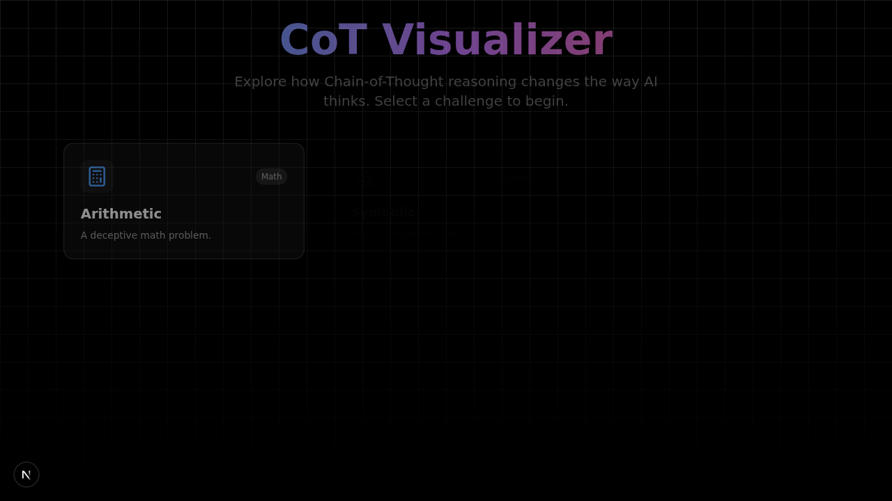
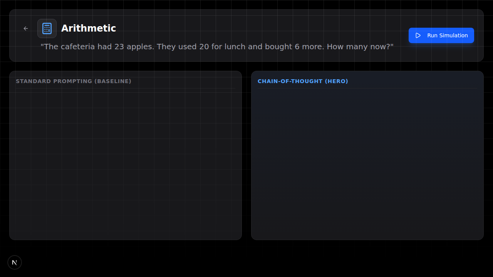

# CoT Visualizer

An interactive demo showing how Chain-of-Thought prompting helps LLMs reason better.

🔗 **[Live Demo](https://cot-visualizer.netlify.app/)** · ✍️ **[Medium Article](https://medium.com/@amirkiarafiei/why-i-built-a-chain-of-thought-visualizer-640ab9fa8eb2)** · 📄 **[Original Paper](https://arxiv.org/abs/2201.11903)**

<p align="center">
  
  
</p>

## What It Does

Compares two prompting strategies side-by-side:
- **Standard:** Quick, intuitive answers (often wrong)
- **Chain-of-Thought:** Step-by-step reasoning (usually correct)

## Features

- 9 interactive challenges (math, logic, riddles)
- Real-time "thinking" visualization
- Custom LLM support via OpenRouter
- Streaming UI with Framer Motion animations

## Quick Start

```bash
git clone https://github.com/amirkiarafiei/chain-of-thought-visualizer.git
cd chain-of-thought-visualizer
npm install
```

Create `.env.local`:
```env
GOOGLE_API_KEY=your_gemini_api_key
```

Run:
```bash
npm run dev
```

## Tech

Next.js 15 · Tailwind CSS · Shadcn/UI · Framer Motion · Google Gemini API

## License

MIT
